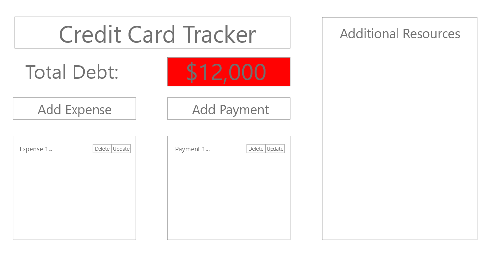
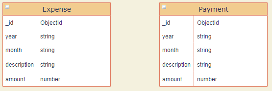
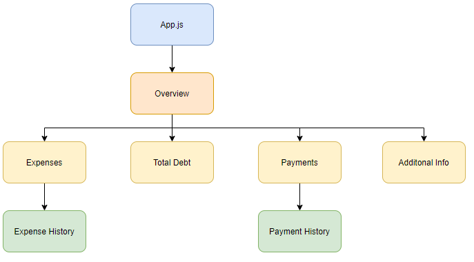

# Credit Card Expense Tracker
### Date Started: 08/30/21
### By: Ryan Craig

[LinkedIn](https://www.linkedin.com/in/ryancraigeit/)

---

>## *Description*

This tracking app will be used to track expenses accumulated on a single credit card. The user will be able to add expenses and payments info while the app would calculate the total current amount of debt on the card in USD.

---
>## *Technologies Used* 

* Mongodb
* Express.js
* React.js
* Node.js

---

>## *Entity Relationship Diagram*

The database will be composed of 2 collections. One for payments and one for expenses. The collections will not be connected by any relationship. 

---
>## *Component Hierarchy Diagram*

---

>## *Task List*

- [ ] Design frontend with React.
- [ ] Build Mongoose Models for both payments and expenses.
- [ ] Use react router to build links for the windows that the user will use to add payments and expenses.
- [ ] Put together seed data for testing.
- [ ] Build routes and controllers using Express. User will be able to GET all present expenses and payments, POST a new payment or expense, and DELETE a payment or expense.
- [ ] Deploy the app using Heroku to test functionality.
- [ ] Style application into a presentable portfolio piece and implement post MVP requirements.