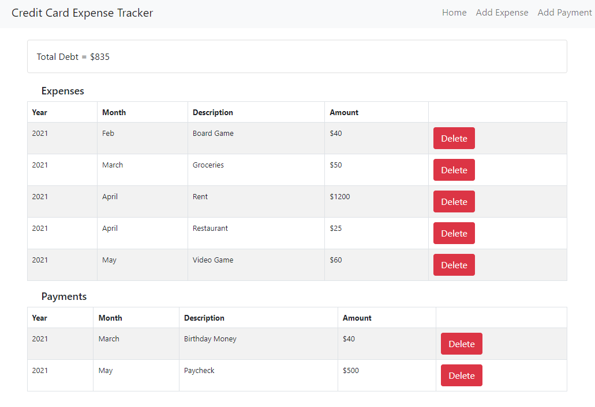

# Credit Card Expense Tracker
### Date Started: 08/30/21
### By: Ryan Craig

[LinkedIn](https://www.linkedin.com/in/ryancraigeit/) | [Credit Card Expense Tracker](https://pacific-bayou-56761.herokuapp.com/)

---

>## *Description*
The Credit Card Expense Tracker is a MERN app that can be used to track expenses, payments, and debt accumulated on a single credit card. Currently deployed on heroku, this app is a starter project that can later evolve into a full service budgeting tool.

---

>## *Getting Started*
Click on the link at the top of the ReadMe that says "Credit Card Expense Tracker". After you are redirected, you can play with the app's functionality by adding payments, expenses, and deleting transactions as needed.

---

>## *Technologies Used* 
* MongoDB
* Express.js
* React.js
* Node.js
* Bootstrap
* React-Bootstrap

---

>## *Future Updates*

- [ ] Incorporate a button or contol that can allow a user to update a transaction.
- [ ] Incorporate a budget related API to fetch articles and other helpful information that can help someone take control of their finances.
- [ ] Allow the user to input data related to multiple credit cards, and a bank account.
- [ ] Incorporate additional styling and improve upon the color scheme.